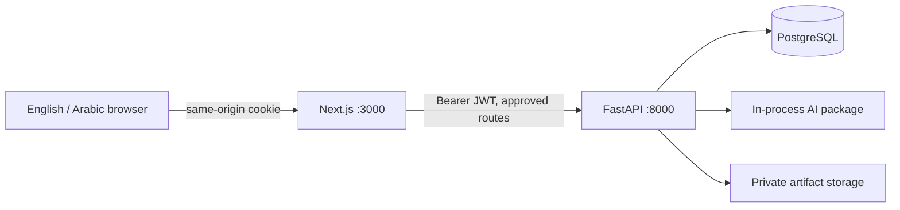

# UniAssist — product, experience, and agent reference

Read this file before changing UI, academic rules, API contracts, roles, grading, or AI behavior.
It documents the product, not just an implementation sequence. The implementation sequence is in [plan.md](plan.md).
The active expansion plan and resumable checkpoint are in
[BACKEND_UI_INTEGRATION_PLAN.md](backend/docs/BACKEND_UI_INTEGRATION_PLAN.md). Read its checkpoint
before continuing work after a session boundary; do not infer completion from planned features.

## Product and purpose

UniAssist is a human-supervised university workspace for labs, assignments, and projects.
Students need to know what to do, whether their work was received, and how to improve.
Teaching assistants need consistent preparation and review tools; professors retain final academic authority.

The learning promise is feedback with evidence, not merely a number. UniAssist is task-centered:
there are no course, enrollment, attendance, or publishing entities. Do not present it as a complete LMS.

```mermaid
flowchart LR
    Task[Staff creates task] --> Rubric[Staff or AI drafts rubric]
    Rubric --> Approval[Professor accepts a version]
    Approval --> Attempt[Student submits an attempt]
    Attempt --> Evaluation[Staff requests AI evaluation]
    Evaluation --> Review[Staff reviews evidence]
    Review --> Release[Professor confirms or overrides]
    Release --> Feedback[Student receives grade and feedback]
```



AI evaluations are provisional. Approval, submission, evaluation, and release are four distinct events.
A new rubric does not overwrite an earlier version. A new attempt does not overwrite an earlier artifact.

## Sources of truth

- [Frontend API guide](backend/docs/FRONTEND_API_GUIDE.md): routes, shapes, permissions, errors, academic rules.
- Main backend routers, schemas, and services: actual runtime behavior.
- `backend/openapi.json` and generated `frontend/src/lib/api/schema.d.ts`: transport snapshots; regenerate after API changes.
- This file: product meaning, UX priorities, boundaries, and safety expectations.
- Database/AI design documents and the original project brief: broader vision, not proof that a feature has a public endpoint.

Keep this document and the API guide synchronized when a public rule or contract changes.
Do not invent successful responses when integration fails. Surface the failure and preserve user input.

## Release scope and agreed decisions

Implemented service: Node.js 24, Next.js 16 App Router, TypeScript, Tailwind and shadcn-style
Radix components, TanStack Query, React Hook Form/Zod, next-intl, iron-session, Docker.

- English and Arabic are first-class locales, with `/en` and `/ar` routes. Arabic uses RTL.
- This is a local/demo release. Students, TAs, and professors may self-register.
- Self-selected staff roles are not suitable for a university production deployment.
- Labs are visible to their cohort immediately. `scheduled_date` is informational; `due_date` controls submission availability.
- The former one-day/scheduled-day lab restriction is superseded. Never reintroduce it from older design documents.
- Lab creation requires a reference PDF and scheduled date; due date cannot precede scheduled date.
- Assignments enforce their allowed file extensions. With `allow_late=true`, new attempts remain allowed after the deadline until confirmation.
- Other tasks stop accepting attempts at the deadline. Every task stops accepting attempts after any professor-confirmed grade for that student.
- An accepted rubric is required before submission. Students can read its criteria, descriptions,
  points and version on the task and submission form before submitting.
- Individual projects work when `require_team=false`. Team-required projects require a consented,
  TA/professor-approved roster. Each submission and grade still belongs to one student.
- Due soon means a deadline within the next 48 hours.

Task-linked student tutoring is now implemented as the first expansion slice. Conversations are
owner-only, with persisted turns, English/Arabic responses, explicit retries and visible mock mode.
Students can explicitly share/revoke a previewed snapshot with one staff recipient; later messages
remain private. Staff can choose lab experiment guidance or coding hints. Staff-only private grading
guidance and released-result teaching insights are implemented; consult the checkpoint for verification.
Consented project teams, public GitHub evidence, profiles and limited admin operations are implemented. Communication monitoring, automatic
contribution scoring, generated practice, email and notifications remain deferred.
Do not add controls calling imaginary endpoints.

## Roles and authority

| Capability                                  | Student |     TA     | Professor  |
| ------------------------------------------- | :-----: | :--------: | :--------: |
| Discover targeted tasks and own attempts    |   Yes   | Staff view | Staff view |
| Submit text, file, or both                  |   Yes   |     No     |     No     |
| Create tasks and rubric versions            |   No    |    Yes     |    Yes     |
| Save private guidance / view teaching insights | No   |    Yes     |    Yes     |
| Suggest/refine rubrics using AI             |   No    |    Yes     |    Yes     |
| Accept/reject a rubric                      |   No    |     No     |    Yes     |
| Discover submissions and request AI grading |   No    |    Yes     |    Yes     |
| Confirm/override final grade                |   No    |     No     |    Yes     |
| Delete task and linked academic records     |   No    |     No     |    Yes     |

TA and professor share one staff workspace; do not build unrelated products for them.
Admins use a separate account/operations workspace, not an academic workspace. Public admin
registration is closed; operators bootstrap admins through the backend CLI. No admin access to
tasks, assessments, artifacts, original chats or shared transcripts is implied by account management.
Frontend role gating is only usability. FastAPI owns authorization.

Students cannot override cohort/major scoping with query parameters or guessed IDs.
Students can access their own artifacts and the designated reference for an accessible task, not other students' work.

## Architecture and session boundary



The browser calls `/api/session` and `/api/backend/...`, never the AI demo API.
The backend host port is 8001 in root Compose; the frontend uses `http://backend:8000` internally.
The separate `ai-service` container is a demo surface, not the academic system of record.

- JWTs are stored only in an encrypted HttpOnly cookie, never localStorage or exposed session JSON.
- Cookie lifetime does not exceed JWT expiry; SameSite=Lax, Secure for HTTPS APP_URL.
- Mutation requests require the configured APP_URL origin.
- BFF paths/methods are allowlisted. Do not introduce arbitrary URL forwarding or pass backend redirects through.
- Restore identity through `GET /auth/me`.
- A 401 clears the cookie and returns to localized login; a 403 preserves the session.
- Logout clears the frontend cookie and client cache. It does not revoke the backend JWT.
- Authenticated fetches/responses are private and uncached.
- Do not bake SESSION_SECRET or BACKEND_INTERNAL_URL into a client bundle.
- Downloads go through the authenticated server proxy.

## Screen map

All routes are locale-prefixed.

| Route                      | Purpose                                                       |
| -------------------------- | ------------------------------------------------------------- |
| /login, /register          | Role-shaped demo onboarding, session expiry, locale selection |
| /student                   | Action-first tasks, latest attempt summaries, exact deadlines |
| /student/tasks/[id]        | Instructions, reference, eligibility, history                 |
| /student/tasks/[id]/submit | Text/file/both; upload then attempt creation                  |
| /student/submissions/[id]  | Artifact, status, released feedback                           |
| /student/tasks/[id]/tutor  | Private task-linked tutoring; optional owned submission context |
| /student/invitations      | Pending team invitations and consent preview                 |
| /student/tasks/[id]/teams, /staff/tasks/[id]/teams | Project teams; staff status filtering |
| /student/teams/[id], /staff/teams/[id] | Roster, invitations, approval and history |
| /student/teams/[id]/repositories, /staff/teams/[id]/repositories | Public repository proposals and link history |
| /student/repositories/[id], /staff/repositories/[id] | Approval, commit sync, attribution and snapshot capture |
| /staff                     | Tasks, filters, review counts                                 |
| /staff/tasks/new           | Conditional lab/assignment/project creation                   |
| /staff/tasks/[id]          | Instructions, rubric versions, submission review queue        |
| /staff/tasks/[id]/insights | Released-only statistics by rubric version and saved AI suggestions |
| /staff/submissions/[id]    | Exact rubric, evidence, AI assessment, explicit release       |
| /staff/shared-tutoring[/id] | Recipient-only read-only student-shared snapshots            |
| /profile                   | Name and student GitHub username; academic fields read-only    |
| /admin, /admin/users/[id]   | Account search, corrections, suspension and TA/professor changes |
| /admin/audit, /admin/metrics | Content-free event history and aggregate AI operations         |

```text
Task detail
  title / type                         exact deadline
  instructions / reference             rubric readiness
  primary action                       eligibility reason
  student: latest attempt + history
  staff: rubric versions + submission queue

Review
  artifact + attempt                   exact rubric version
  text / authorized download           AI criterion evidence
  code findings                        AI warnings + mock provenance
  professor: final score + explicit confirmation
```

## Student submission experience

Use server-provided `submission_eligibility`; show the reason when unavailable.
Do not infer permission from the deadline alone.

1. Text-only: submit JSON directly.
2. File-only or combined: upload first; retain the returned integer file_id.
3. Create the attempt using text (a non-null string), file_id or null, and the eligibility team_id
   for a team-required project; use null for individual tasks.
4. Show success only when attempt creation succeeds.
5. If creation fails, retain input and the successful upload reference. Retrying must not upload that file again.
6. After an ambiguous timeout, refresh server state before offering another mutation; never automatically retry mutations.

Repository evidence: first save a private commit-pinned snapshot from an approved project-team
repository, then submit repository_snapshot_id instead of file_id, with optional explanation text.
Keep a saved snapshot on submission failure; no need to download GitHub again. It is not a submitted
attempt until submission creation succeeds. Snapshot ownership never follows team membership.

Resubmitting creates a new attempt, preserving earlier work. A file already attached to an attempt
cannot be reassigned: upload a new copy for the new attempt.

| API status      | Student label                 | Staff label           |
| --------------- | ----------------------------- | --------------------- |
| pending         | Submitted                     | Awaiting AI review    |
| ai_graded       | Instructor review in progress | AI review ready       |
| staff_confirmed | Grade released                | Final grade confirmed |

Before confirmation, student API responses contain no provisional assessment content:
AI score, feedback, criterion evaluations, findings, warnings and mock provenance are null;
do not display them using a staff-side cache. Approved grading expectations are not provisional
assessment: rubric criteria remain visible independently of grade release. Task detail exposes only
the currently accepted rubric; an owned attempt exposes its originally associated rubric, even
after replacement. Draft/rejected rubrics and the full version-history endpoint remain staff-only.

After release, prioritize useful feedback, then grade and criterion evidence.
Grades are out of the associated rubric total, never implicitly out of 100.
Show sample/mock assessments prominently as demo output, not real academic evaluation.

## Staff task/rubric experience

The following team rules complement the task/rubric controls below.

### Project teams

Team workflows apply only to projects with require_team=true. Students create a team and invite
classmates by exact student number, with no student directory. Members must match the task's
cohort/major and can hold only one active membership per task. Creation records owner consent;
invitees preview the current roster before accepting. Pending invitations do not reserve membership.
All invitees must accept before the owner requests approval. Either a TA or professor reviews
and approves the exact roster. There is no new professor-only team restriction.

Roster changes invalidate approval. Members may leave and owners may remove/cancel invitations
or archive an unlocked team. The owner archives rather than leaving. First successful team-linked
submission permanently locks membership for everyone, retaining its approved roster snapshot.
Use the server's actions/version and eligibility, not inferred permissions. Refresh after conflicts;
never silently approve a changed roster. Request UUIDs deduplicate mutations and history is retained.
Maximum 20 accepted members plus pending invitations; no minimum team size is imposed.

Teams grant no access to others' submissions, files, feedback, grades or original chats. Students
submit and receive grades individually. Deadlines, rubric readiness and confirmation cutoffs still
apply to each student. Submission review shows the frozen roster, not a mutable current roster.
Legacy teams have unknown consent/approval, remain read-only and submission-blocked, and retain
membership slots pending a separately reviewed remediation. Never auto-approve or discard them.

### Public repository evidence

Only approved team-required projects support this integration. A current member proposes a canonical
public GitHub link; either TA or professor approves it for the exact currently approved team version.
Roster changes require repository reapproval. One link is active per team; replacement preserves old
links, commits, attribution events and submitted evidence. Historical unverified links are read-only.

Sync is explicit and bounded to 100 recent default-branch commits. Show its timestamp, partial-history
notice and failures. GitHub metadata supplies a username, not proof of student identity or effort.
Staff explicitly assign/correct/clear each commit association to a current member; preserve corrections
in history. Counts never grade contribution. A captured snapshot freezes the selected commit's current
reviewed attribution; later corrections do not rewrite it. This is evidence, not an individual-effort claim.

Capture full 40-character SHAs, never mutable branch names. Keep original compressed bytes, archive
SHA-256, file manifest, capture time, repository identity and approval/roster versions in PostgreSQL.
Only the owning student or teaching staff can read/download a snapshot. Grading uses saved bytes and
existing rubric/release rules, even if the source later disappears or the active link is replaced.
Show SHA provenance beside findings and honest omitted-file warnings. No automatic grading on sync.

Client requests and redirects are host/path allowlisted; only unauthenticated public GitHub is supported.
Reject unsafe paths, links, malformed archives and size/count excesses. Never execute code, clone with
hooks, install dependencies or silently fetch external objects. Text/file fallback remains usable.
Verification fixtures require explicit server-only GITHUB_FIXTURE_MODE and MOCK_MODE. Label fixtures
separately from mock AI; they are never a silent network fallback. Do not claim live-provider acceptance
from fixture tests. Database backups must include stored archives; automatic cleanup is not implemented.

### Task and rubric controls

- Use “Create task”, never “Publish”: no draft/publish lifecycle exists.
- Labs upload a PDF first, then include reference_file_id in task creation.
- Assignment/project creation does not require a reference file.
- Show cohort and canonical major values; blank major means all majors in that cohort.
- Rubrics can be manual, AI-suggested, or refined into another version.
- Show name, description, points, total, version, source, and status.
- New versions are pending. Professor acceptance replaces the previously accepted version.
- Acceptance makes criterion names, descriptions and points visible to students. These fields must
  contain student-facing expectations, not model answers or private marking notes. Private grading
  guidance has its own staff-only versioned field. There is no automatic semantic redaction; review AI drafts before approval.
- Target mutations by rubric_id; the API also retains version-based compatibility.
- Rubric criteria are never edited in place; accepted rubrics remain attached to historical attempts.
- Submissions queue defaults to latest attempts; status and historical-attempt filters remain available.
- Only the latest pending attempt can be AI evaluated. Concurrent grading is rejected, not duplicated.
- Review uses the submission's rubric, even if a newer rubric is now accepted.
- Final score must be finite and between zero and that rubric's total.
- Professor overrides affect only the overall final grade. AI criterion scores remain labeled AI assessment.
- Finalization is explicit and closes further attempts.
- Deletion confirmation explains loss of related academic records. Physical files are retained on disk;
  record deletion removes API access. Storage retention/cleanup is a separate operational policy.

The backend uses transaction-scoped task/student locks. While synchronous evaluation holds a lock,
a resubmission or competing evaluation receives a retryable conflict rather than racing the result.

## Bilingual and accessibility rules

- Language switching keeps the current route and query filters.
- Set document lang and dir; use logical spacing and direction-aware dialogs.
- Isolate filenames, identifiers, email, code and mixed-direction content.
- Translate UI labels, stable error codes, validation, confirmations, states and navigation.
- Do not translate staff-authored task content or persisted AI feedback automatically.
- Academic prose uses the shared Markdown/math viewer, including task instructions, rubrics,
  released feedback, private guidance, tutoring/shares and insights. It supports `$…$`, `$$…$$`,
  `\(…\)` and `\[…\]`, with local staff authoring previews. Preserve original saved strings,
  literal artifact/code display, staff-only guidance and grade-release gates. See README syntax.
- Preserve enum values and cohort/major values independently of displayed labels.
- Show exact timestamps in the user's timezone; send dates with explicit timezone offsets.
- Use a bundled Arabic-capable font; no build-time external font fetch.
- Loading, empty, validation, permission, unavailable, success and retry are real states.
- Preserve form input on failure. Announce upload/evaluation stages accessibly.
- Maintain keyboard access, visible focus, semantic labels, readable errors, contrast, and mobile layouts.
- Use calm academic surfaces with restrained teal accents; do not make the product look like an autonomous answer bot.

## Tutoring and broader vision

Socratic help should guide through questions and hints, never complete assessed work or expose hidden answers.
The main API now exposes owner-only task chat using the tutor/lab-assistant package. Tutoring does
not require an approved rubric and remains available after deadlines and grade release if task access
still holds. Context uses public instructions/reference/approved criteria and optionally an owned
submission's text; released feedback only. Uploaded artifacts are not read implicitly: students may
paste a focused excerpt. Never pass private model answers or unreleased feedback to the tutor.
Conversation language is fixed at creation; UI language switching does not translate stored messages.
Completed turns and preserved legacy user/assistant messages enter bounded history, never system
messages or failed turns. Request IDs deduplicate writes and explicit retry recovers failed/interrupted
turns. Staff/admin cannot read original chats. A student may preview and share completed turns through
a selected question with one exact staff email. Recipients see only that frozen snapshot, not later
messages. Revocation blocks future access but cannot retract content already seen. Legacy messages
have unknown provenance and are excluded from shares. Sharing never affects grading.
Private grading guidance is immutable and staff-only. Grading chooses the latest version when it
starts and records that ID on the evaluation; new versions never change earlier evaluations. Empty
versions disable guidance for future evaluations. Guidance goes only to grading_key, never tutor or
rubric generation. Review all assessment text before professor confirmation: prompts cannot guarantee
that a real model will not quote private solutions. Students never receive private guidance metadata/content.

Teaching insights use the latest professor-confirmed attempt per student, grouped by rubric version.
At least three qualifying students per group are required (configurable upward). Original AI criterion
statistics are distinct from professor-adjusted final grades. Missing/ambiguous criterion evidence is
excluded; criterion means also require the minimum sample count. No student rankings or risk labels.
Only numeric grades, anonymous criterion labels and aggregate severity counts reach the analysis model:
no task prose, identities, student work, feedback, filenames or chat. Reports preserve language, timestamp,
input snapshot/fingerprint and actual mock provenance. New releases make prior task reports stale.
Generation is explicit; statistics are calculated, AI suggestions are provisional teaching aids.

Team repositories, commits and communication analysis require identity correction, source transparency,
consent/governance and contestability. Commit counts or message volume are not reliable effort scores.
Email feedback and tailored practice are future ideas, not promises the UI may make.

## Implementation and verification references

### Account and operational boundaries

Self-service edits are name and student GitHub username only. Admin corrections support name/email,
student number/cohort/major/GitHub, staff department, active status and TA/professor transitions only.
No deletion, password reset or student/staff/admin conversion API exists. Every edit checks
expected_version; refresh after conflicts without silently overwriting user input. Historical rosters,
submissions and attribution remain frozen; corrected academic identity changes future task access.
GitHub names never imply verified attribution. Suspension is checked on login and each authenticated
request, including existing JWTs; in-flight work is not cancelled. Reactivation restores still-valid
JWT access. Last-active-admin protection and bootstrap share a transaction lock.

Audit records contain actor/target IDs, action codes, changed field names and time, never previous
values or transcripts. Records begin at Phase 5; do not fabricate historical events. AI operations
persist separately from academic transactions, including failures and unfinished starts. Aggregate
counts are application calls, not provider billing/retries. Show unknown provenance honestly; mock
usage follows the actual engine (including no-key mock mode), not just an environment flag. Never
log prompts, replies, provider exception bodies, credentials or arbitrary AI metadata. Private content
must not appear in operational views. File metadata exposes safe names/type/purpose/size/time, no
storage paths; downloads retain academic authorization. See the API guide for full contracts.

- `frontend/src/features/`: student/staff/auth experiences.
- `frontend/src/lib/server/` and `src/app/api/`: session and BFF boundary.
- `frontend/messages/`: English/Arabic catalogs; key parity is tested.
- `backend/backend/services/access.py`: shared academic eligibility and concurrency policy.
- `backend/backend/services/submission_service.py`: persistence, artifacts, release filtering.
- `backend/backend/services/grading_service.py`: associated-rubric evaluation and confirmation.
- `backend/tests/`: real PostgreSQL/HTTP and migration checks.
- `frontend/tests/`: focused component and real-backend Playwright tests.
- [README](README.md): Docker, development, tests and environment setup.

Never reset a database or delete a volume to make migrations pass.
Older lost submission text stays empty; unknown original filenames use a safe generated-name fallback.
Read verification results honestly: an implemented path is not automatically a verified path.
