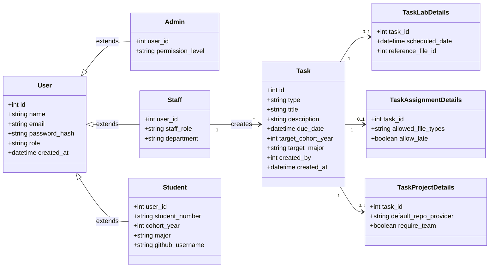
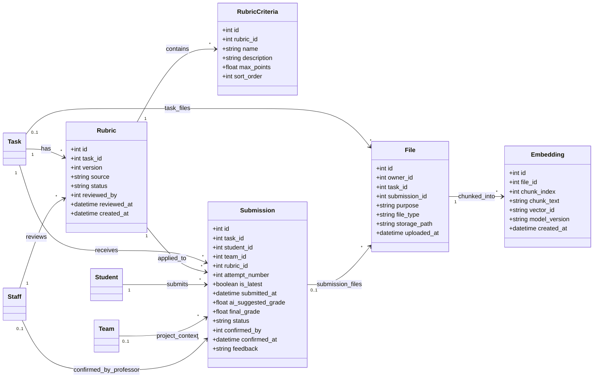
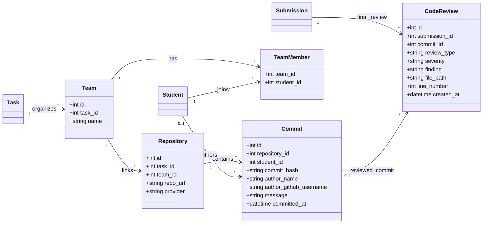
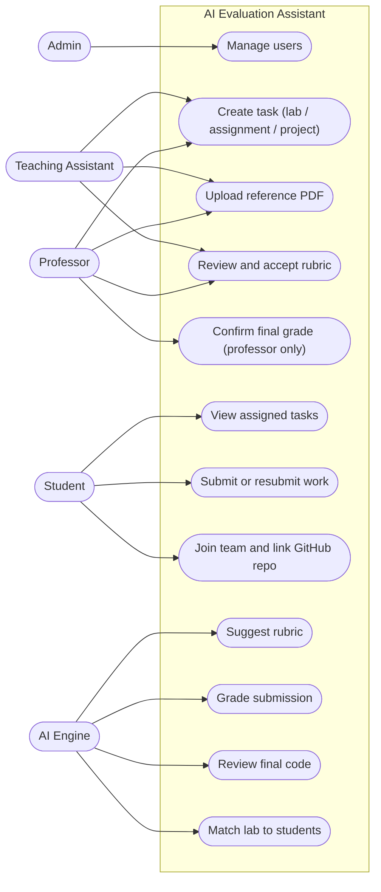
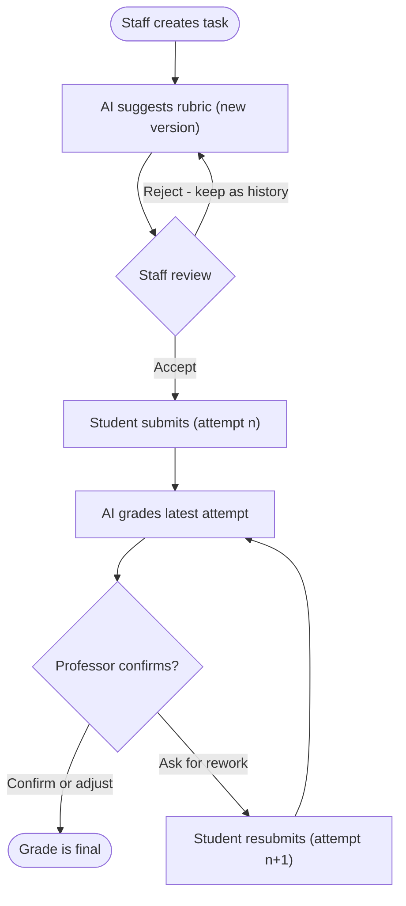

# 🎓 AI Evaluation Assistant - University Task & Lab Hub

An end-to-end, university-focused AI assistant built with **FastAPI**, **Groq (GPT-120B / Llama 3.3)**, and **Google Gemini** that enables university professors, TAs, and students to seamlessly generate rubrics, grade submissions, run interactive lab sessions, and manage automated code reviews.

| | |
|---|---|
| **Status** | MVP Engine, API & Dashboard Ready |
| **System overview** | [docs/SYSTEM_OVERVIEW.md](./docs/SYSTEM_OVERVIEW.md) |
| **Backend integration** | [docs/BACKEND_CONNECTION.md](./docs/BACKEND_CONNECTION.md) |

---

## 🌟 Key Capabilities & Features

### 1. 📝 AI Rubric Generator & Interactive Refinement
- **Specification Parsing**: Upload task specification files (**PDF, DOCX, TXT**) or paste specification text to automatically generate domain-tailored evaluation rubrics.
- **Interactive AI Re-prompting**: Refine rubrics dynamically with staff instructions (e.g. *"Make each criterion out of 20 points"* or *"Add weight for memory management"*).
- **Manual Rubric Editing**: TAs and professors can manually add, edit, or remove criteria and point allocations via API / backend UI.

### 2. 🔍 Submission Evaluator & Code Reviewer
- **Multi-Format Uploads**: Grade student submissions submitted as **PDF, DOCX, TXT, PY, CPP, HPP, or ZIP archives**.
- **Criterion Score Breakdown**: Produces detailed score breakdowns, max point enforcement, and constructive reasoning for each criterion.
- **Static Code Analysis & AI Code Review**: Highlights severity levels (`info`, `warning`, `critical`), file paths, line numbers, and actionable recommendations.

### 3. 🧪 AI Lab Assistant (Live Student Sessions)
- **Experiment Guide Mode (Hardware & Physics Labs)**: Provides step-by-step procedural routing, apparatus setup checks, and physical theory explanations.
- **Coding Hint Mode (Software & Algorithm Labs)**: Enforces strict **Socratic guardrails** that shield direct model solutions while providing guided hints.

### 4. 🧑‍🏫 TA Lab Management & Batch Grading Portal
- **Lab Creation & Setup**: TAs can upload lab titles, lab types (*experiment* or *coding*), procedure steps, theoretical questions, and model answers.
- **Batch AI Grading**: Grade all submitted student lab reports in 1-click against the TA's rubric and model answer key.

### 5. 🎓 University Task & Role Flow
- **Cohort & Major Targeting**: Staff create tasks (labs, assignments, projects) targeted by cohort year, scheduled dates, and major.
- **Role-Based Authority**: TAs can create tasks, generate rubrics, and run AI grading; **only professors** can finalize grades (`staff_confirmed`).
- **Individual Grading & Team Projects**: Supports team projects with GitHub repository links while maintaining per-student submission evaluation and commit attribution.

---

## 🏗️ System Architecture & Data Model

The application supports both lightweight file-backed JSON storage for local runtime execution (`data/`) and a fully specified relational database architecture for production scaling.

### A. Runtime Storage (`data/`)

```
data/
├── labs_data.json         # Storage for TA-configured experiment & coding labs
└── submissions_data.json  # Storage for student lab submissions and AI grading evaluations
```

#### Lab Data Schema (`labs_data.json`)
```json
{
  "id": "lab-1",
  "title": "Lab 1: RC Circuit Transient Dynamics",
  "lab_type": "experiment",
  "description": "Hardware experiment analyzing RC step response...",
  "steps_and_theory": "Step 1: Wire resistor... Step 2: Measure tau...",
  "model_answers": "tau = R * C = 10ms...",
  "rubric_json": "[... criteria array ...]"
}
```

#### Submission Data Schema (`submissions_data.json`)
```json
{
  "id": "sub-1",
  "lab_id": "lab-1",
  "student_name": "John Doe",
  "student_id": "STU-100",
  "submission_text": "Measured tau = 10ms...",
  "submitted_at": "2026-09-01 00:32:17",
  "status": "graded",
  "grade_result": {
    "ai_suggested_grade": 90.0,
    "total_possible_grade": 100.0,
    "percentage": 90.0,
    "summary_feedback": "...",
    "criterion_evaluations": [...],
    "code_reviews": [],
    "warnings": []
  }
}
```

---

### B. UML Class Diagrams (Relational Database Design)

The entity model is split into three views so each one stays readable. A class drawn without attributes in one view is fully defined in another view.

#### 1. Identity and Tasks

Inheritance is implemented as extension tables (`Admin`, `Staff`, `Student` share `User.id` as their primary key).



#### 2. Rubrics, Submissions and Files



#### 3. Teams, GitHub and Code Review



#### Enumerated Values

| Field | Allowed Values |
|---|---|
| `User.role` | `admin`, `professor`, `teaching_assistant`, `student` |
| `Staff.staff_role` | `professor`, `teaching_assistant` |
| `Task.type` | `lab`, `assignment`, `project` |
| `Rubric.source` | `ai_suggested`, `staff_created` |
| `Rubric.status` | `pending`, `accepted`, `rejected`, `replaced` |
| `Submission.status` | `pending`, `ai_graded`, `staff_confirmed` |
| `File.purpose` | `reference`, `submission`, `other` |
| `CodeReview.severity` | `info`, `warning`, `critical` |

---

## 🗺️ System Workflows & UML Diagrams

### A. UML Use Case Diagram



---

### B. UML Activity Diagram (Grading Flow)

Same flow applies for labs, assignments, and projects.



**Workflow Notes:**
- Rejected rubrics are **kept** as history, not deleted — the next AI suggestion becomes a new `version`.
- A resubmission creates a new `SUBMISSIONS` record; only the latest attempt is graded, and grades are always **per student**, including on team projects.
- TAs can manage task creation, rubric review, and AI grading (`ai_graded`); only a **professor** can move a submission to `staff_confirmed`.

---

## 🚀 Developer Quickstart & Setup Guide

### 1. Prerequisites
- **Python 3.10+** installed on Windows, macOS, or Linux.
- **Git** repository cloned locally.

### 2. Environment & Dependency Setup
```bash
# 1. Create Python virtual environment
python -m venv venv

# 2. Activate virtual environment
# On Windows (PowerShell):
.\venv\Scripts\Activate.ps1
# On macOS/Linux:
source venv/bin/activate

# 3. Install dependencies
pip install -r requirements.txt
```

### 3. Configure Environment Variables
Copy `.env.example` to create your local `.env`:
```bash
cp .env.example .env
```
Fill in your API keys in `.env`:
- `GROQ_API_KEY=gsk_...` (or `GEMINI_API_KEY=...`)
- Set `MOCK_MODE=true` to test the system offline without external API keys.

### 4. Launch the API
```bash
python app.py
```
Or via `uvicorn`:
```bash
uvicorn app:app --reload --port 8000
```
- Swagger docs: **http://127.0.0.1:8000/docs**
- Health: **http://127.0.0.1:8000/api/ai/health**
- Docker: `docker compose up --build` (API only; no web UI)

### 5. Run the Test Suite
```bash
cd AI-Service
pytest -v
```

---

## 🔌 API Endpoints Summary

| Endpoint | Method | Description |
|---|---|---|
| `/` | `GET` | API service info (JSON) |
| `/docs` | `GET` | OpenAPI / Swagger UI (FastAPI built-in) |
| `/api/ai/health` | `GET` | AI health check |
| `/api/ai/metrics` | `GET` | AI ops metrics |
| `/api/suggest-rubric` | `POST` | Generates initial AI rubric from spec file or text |
| `/api/refine-rubric` | `POST` | Refines existing rubric using staff prompt feedback |
| `/api/grade-submission` | `POST` | Grades a student submission against spec & rubric |
| `/api/student-chat` | `POST` | Socratic tutor chat for general assignment help |
| `/api/labs` | `GET` | Retrieves all active labs |
| `/api/labs/{lab_id}` | `GET` | Retrieves lab details by ID |
| `/api/create-lab` | `POST` | Creates a new lab session with spec, theory, & model answers |
| `/api/delete-lab/{lab_id}` | `DELETE` | Deletes a lab session and its submissions |
| `/api/submit-lab` | `POST` | Submits student work for a lab |
| `/api/lab-chat` | `POST` | Live AI Lab Assistant chat (Step guidance / Hint mode) |
| `/api/grade-all-submissions/{lab_id}` | `POST` | Batch grades all submissions for a specified lab |

---

## 📊 MVP vs Post-MVP Roadmap

| In MVP | Post-MVP |
|---|---|
| Labs, assignments, projects | Extra activity types |
| Cohort + major targeting | Full course / section / term model |
| Rubric → AI grade → staff confirm | Auto-final grades |
| GitHub sync + final code review | Per-commit incremental reviews |
| File-backed JSON data storage | Full PostgreSQL migration with SQLAlchemy ORM |
| — | Chat monitoring & collaboration analytics |

---

## 📂 Repository Layout

```
AI-Service/
├── app.py                 # FastAPI REST API (no web UI)
├── ai_tutor/              # AI package (AIService, engine, models, …)
├── Dockerfile             # API-only container
├── docker-compose.yml
├── data/                  # Demo JSON persistence
├── tests/                 # pytest suite
├── docs/                  # SYSTEM_OVERVIEW, BACKEND_CONNECTION, POSTMAN_TESTS
├── requirements.txt
└── .env.example
```

---

## 📚 Documents & How to View Diagrams

| File | Contents |
|---|---|
| [DATABASE_DESIGN.md](./DATABASE_DESIGN.md) | Full schema, decisions, open questions, review checklist |
| [README.md](./README.md) | Overview, API endpoints, setup guide & UML diagrams (this file) |

### Viewing Mermaid Diagrams
- **GitHub / GitLab:** Mermaid renders automatically in markdown preview.
- **VS Code / Cursor:** Install a Mermaid preview extension (e.g. *Markdown Preview Mermaid Support*) to render diagrams inline.
- **Export:** Copy diagram blocks into [mermaid.live](https://mermaid.live) to render and download PNG/SVG visuals.