# AI Evaluation Assistant For Universities

**Audience:** team review (product + engineering)  
**Status:** proposed for MVP  
**Last updated:** 2026-08-26  

**UML diagrams (use case, class, activity):** see [README.md](./README.md)

---

## 1. Purpose of this document

This document describes the **database design for the MVP** of our AI Evaluation Assistant.

Please review for:

1. Does this match the product we agreed to build?
2. Are any MVP tables missing or unnecessary?
3. Are the open questions at the end blocking before we implement?

---

## 2. What we are building (and what we are not)

### We are building

An **AI assistant for university staff** that helps run and evaluate:

| Activity | What the system does |
|---|---|
| **Labs** | Staff uploads a reference PDF; AI matches the lab to students (cohort + date + major); AI suggests a rubric; staff accepts; AI grades submissions; staff confirms grades |
| **Assignments** | Staff creates an assignment for a cohort/major; students submit files; same AI rubric → grade → staff confirm flow |
| **Projects** | Team-based work with a linked GitHub repo; AI reviews the **final** submission (not every commit); staff confirms grades |

### We are not building (MVP)

- A full course / LMS platform (no course catalog, enrollment portal, or timetable)
- Auto-final grades with no human review
- Chat monitoring (Discord / Slack / WhatsApp)
- Deep collaboration analytics dashboards

Those ideas are listed under **Post-MVP** at the end so they are not lost.

---

## 3. Roles

| Role | Who | Main capabilities |
|---|---|---|
| `admin` | System administrator | Manage users and system settings |
| `professor` | Teaching staff | Create tasks, review rubrics, **confirm final grades** |
| `teaching_assistant` | Teaching staff | Create tasks, review rubrics — **cannot confirm final grades** |
| `student` | Learner | View assigned tasks, submit work, see confirmed grades/feedback |

**Modeling note:** Professors and TAs share one `STAFF` extension table; the
`staff_role` column separates them.

**Decision — grade authority:** only a `professor` may set
`SUBMISSIONS.status = staff_confirmed`. A TA can prepare everything up to that
point (create the task, accept the rubric, review AI output), but the final
grade needs a professor. Enforced in the application layer and by a check that
`confirmed_by` points to a staff row with `staff_role = 'professor'`.

---

## 4. Core workflows (how data is used)

### 4.1 Lab matching (no manual enrollment)

1. Staff creates a **lab** task and uploads a reference PDF.
2. Lab is targeted by `cohort_year` + `scheduled_date` + `major`.
3. The lab is visible **only on `scheduled_date`** — not before, not after.
4. Students submit work; files are linked to the **submission**.
5. AI suggests a rubric → staff accepts/rejects → AI grades → professor confirms.

**Decision — visibility window:** labs appear for exactly one day. Practical
consequence to agree on: the submission window closes with the day, so
`due_date` for a lab should fall on `scheduled_date`. If a student misses the
day, a staff member has to reopen it manually.

### 4.2 Assignment flow

1. Staff creates an **assignment** with due date and target cohort/major.
2. Students submit files against that task.
3. Same rubric and grading flow as labs.

### 4.3 Project flow (GitHub)

1. Staff creates a **project** task.
2. Students form **teams**; each team links a GitHub repository.
3. System syncs commits (mapped via each student’s `github_username`).
4. On the final submission, AI runs code review **once** (not on every commit).
5. Professor confirms the grade **per student**.

**Decision — individual grades:** even on team projects, every student gets
their own grade. The team is context (shared repo, shared deliverable), not the
unit of grading, so each team member has their own `SUBMISSIONS` row carrying
`team_id`. This is what makes commit-level attribution useful: two students on
the same repo can receive different grades.

### 4.4 Grading rule (all task types)

```
pending → ai_graded → staff_confirmed
```

A grade is **never final** until a **professor** confirms it.

**Decision — resubmissions allowed:** a student may submit more than once for
the same task. Each attempt is a new `SUBMISSIONS` row with an incremented
`attempt_number`; the newest row has `is_latest = true`. Only the latest attempt
is graded and code-reviewed, but earlier attempts are kept for history.

---

## 5. MVP scope: what is in the schema

### In scope (MVP tables)

| Area | Tables |
|---|---|
| Identity | `USERS`, `ADMINS`, `STAFF`, `STUDENTS` |
| Work items | `TASKS`, `TASK_LAB_DETAILS`, `TASK_ASSIGNMENT_DETAILS`, `TASK_PROJECT_DETAILS` |
| Rubrics | `RUBRICS`, `RUBRIC_CRITERIA` |
| Delivery | `SUBMISSIONS`, `FILES`, `EMBEDDINGS` |
| Teams & GitHub | `TEAMS`, `TEAM_MEMBERS`, `REPOSITORIES`, `COMMITS`, `CODE_REVIEWS` |

### Out of scope for MVP (deferred)

| Deferred idea | Why deferred |
|---|---|
| `COURSE` / `SECTION` / academic term | Full LMS; MVP uses cohort + major targeting instead |
| Chat monitoring tables | Privacy, API complexity, not needed to ship grading |
| Collaboration analytics tables | Valuable later; not required for first grading release |
| Extra activity types (quiz, presentation, …) | MVP supports only `lab`, `assignment`, `project` |

---

## 6. Entity-Relationship Diagram (MVP)

```mermaid
erDiagram
    USERS ||--o| ADMINS : extends
    USERS ||--o| STAFF : extends
    USERS ||--o| STUDENTS : extends
    USERS ||--o{ FILES : uploads

    STAFF ||--o{ TASKS : creates
    STAFF ||--o{ RUBRICS : reviews

    TASKS ||--o| TASK_LAB_DETAILS : "if type=lab"
    TASKS ||--o| TASK_ASSIGNMENT_DETAILS : "if type=assignment"
    TASKS ||--o| TASK_PROJECT_DETAILS : "if type=project"
    TASKS ||--o{ RUBRICS : has
    TASKS ||--o{ SUBMISSIONS : receives
    TASKS ||--o{ TEAMS : organizes
    TASKS ||--o{ FILES : "task-level files"

    TASK_LAB_DETAILS }o--|| FILES : "reference PDF"

    RUBRICS ||--o{ RUBRIC_CRITERIA : contains
    RUBRICS ||--o{ SUBMISSIONS : applied_to

    STUDENTS ||--o{ SUBMISSIONS : submits
    STUDENTS ||--o{ TEAM_MEMBERS : joins
    STUDENTS ||--o{ COMMITS : authors

    SUBMISSIONS ||--o{ FILES : "submission files"
    SUBMISSIONS ||--o{ CODE_REVIEWS : "final review"
    TEAMS ||--o{ TEAM_MEMBERS : has
    TEAMS ||--o{ REPOSITORIES : links
    TEAMS ||--o{ SUBMISSIONS : "team submit (projects)"

    TASKS ||--o{ REPOSITORIES : "project repos"
    REPOSITORIES ||--o{ COMMITS : contains
    COMMITS ||--o| CODE_REVIEWS : "final commit reviewed"

    FILES ||--o{ EMBEDDINGS : chunked_into

    USERS {
        int id PK
        string name
        string email
        string password_hash
        string role "admin|professor|teaching_assistant|student"
        datetime created_at
    }

    ADMINS {
        int user_id PK "FK -> USERS.id"
        string permission_level
    }

    STAFF {
        int user_id PK "FK -> USERS.id"
        string staff_role "professor|teaching_assistant"
        string department
    }

    STUDENTS {
        int user_id PK "FK -> USERS.id"
        string student_number
        int cohort_year
        string major
        string github_username "nullable"
    }

    TASKS {
        int id PK
        string type "lab|assignment|project"
        string title
        text description
        datetime due_date
        int target_cohort_year
        string target_major "nullable = all majors"
        int created_by FK
        datetime created_at
    }

    TASK_LAB_DETAILS {
        int task_id PK "FK -> TASKS.id"
        datetime scheduled_date
        int reference_file_id FK
    }

    TASK_ASSIGNMENT_DETAILS {
        int task_id PK "FK -> TASKS.id"
        string allowed_file_types "e.g. pdf,zip,ipynb"
        boolean allow_late
    }

    TASK_PROJECT_DETAILS {
        int task_id PK "FK -> TASKS.id"
        string default_repo_provider "github"
        boolean require_team
    }

    RUBRICS {
        int id PK
        int task_id FK
        int version "1, 2, 3 ... per task"
        string source "ai_suggested|staff_created"
        string status "pending|accepted|rejected|replaced"
        int reviewed_by FK "professor or TA"
        datetime reviewed_at
        datetime created_at
    }

    RUBRIC_CRITERIA {
        int id PK
        int rubric_id FK
        string name
        text description
        float max_points
        int sort_order
    }

    SUBMISSIONS {
        int id PK
        int task_id FK
        int student_id FK "always set - grades are individual"
        int team_id FK "nullable - team context for projects"
        int rubric_id FK
        int attempt_number "1, 2, 3 ... resubmissions allowed"
        boolean is_latest "only the latest attempt is graded"
        datetime submitted_at
        float ai_suggested_grade
        float final_grade
        string status "pending|ai_graded|staff_confirmed"
        int confirmed_by FK "professor only"
        datetime confirmed_at
        text feedback
    }

    TEAMS {
        int id PK
        int task_id FK
        string name
    }

    TEAM_MEMBERS {
        int team_id FK
        int student_id FK
    }

    REPOSITORIES {
        int id PK
        int task_id FK
        int team_id FK
        string repo_url
        string provider "github"
    }

    COMMITS {
        int id PK
        int repository_id FK
        int student_id FK "nullable until mapped"
        string commit_hash
        string author_name
        string author_github_username
        text message
        datetime committed_at
    }

    CODE_REVIEWS {
        int id PK
        int submission_id FK
        int commit_id FK "final commit reviewed"
        string review_type "static_analysis|ai_code_review"
        string severity "info|warning|critical"
        text finding
        string file_path
        int line_number
        datetime created_at
    }

    FILES {
        int id PK
        int owner_id FK
        int task_id FK "nullable"
        int submission_id FK "nullable"
        string purpose "reference|submission|other"
        string file_type
        string storage_path
        datetime uploaded_at
    }

    EMBEDDINGS {
        int id PK
        int file_id FK
        int chunk_index
        text chunk_text
        string vector_id "pointer to vector DB"
        string model_version
        datetime created_at
    }
```



---

## 7. Table reference

### 7.1 Identity

#### `USERS`
Base account for everyone. `role` drives which extension row exists.

#### `ADMINS` / `STAFF` / `STUDENTS`
Role-specific fields:

- **Staff:** department + `staff_role` (`professor` | `teaching_assistant`)
- **Students:** `student_number`, `cohort_year`, `major`, `github_username` (needed to map Git commits to students)

### 7.2 Tasks

#### `TASKS`
One table for all work items. `type` is `lab`, `assignment`, or `project`.

**Visibility (MVP rule):** a student sees a task when:

- `target_cohort_year` matches their `cohort_year`, **and**
- `target_major` is null **or** matches their `major`

Labs additionally use `TASK_LAB_DETAILS.scheduled_date` (e.g. show on that day).

#### `TASK_LAB_DETAILS`
Lab-only fields: scheduled date + reference PDF (`reference_file_id` → `FILES`).

#### `TASK_ASSIGNMENT_DETAILS`
Light assignment settings: allowed file types, whether late submissions are allowed.

#### `TASK_PROJECT_DETAILS`
Project settings: default repo provider (GitHub), whether a team is required.

### 7.3 Rubrics

#### `RUBRICS`
Human-in-the-loop checkpoint:

| Field | Meaning |
|---|---|
| `version` | Attempt number for this task: 1, 2, 3 … |
| `source` | `ai_suggested` or `staff_created` |
| `status` | `pending` → `accepted`, `rejected`, or `replaced` |

Only an **accepted** rubric is used for grading.

**Decision — keep rubric history:** rubrics are never overwritten or deleted. If
the AI suggests a rubric and staff reject it, that row stays with
`status = rejected` and the next suggestion is inserted as a new row with the
next `version`. If an already-accepted rubric is superseded, the old row moves to
`status = replaced`.

Two reasons this matters:

- **Audit:** `SUBMISSIONS.rubric_id` points at the exact rubric version used, so
  a grade given in week 3 stays explainable even after the rubric changes.
- **AI quality:** the rejected rows are the training signal for how often staff
  disagree with AI suggestions.

Rule: at most **one** rubric per task may be in `accepted` state at a time.

#### `RUBRIC_CRITERIA`
Structured criteria (name, description, max points, order) so AI grading is reproducible and staff can edit weights clearly. Prefer this over one free-text blob.

### 7.4 Submissions and files

#### `SUBMISSIONS`
Tracks AI grade, final grade, rubric used, and confirmation audit trail (`confirmed_by`, `confirmed_at`).

**Individual vs team:** grading is always individual, so `student_id` is
**always set**.

| Task type | `student_id` | `team_id` |
|---|---|---|
| Lab / assignment | set | null |
| Project | set (one row per team member) | set (which team they worked in) |

**Resubmissions:** multiple attempts per student per task are allowed.

| Field | Meaning |
|---|---|
| `attempt_number` | 1 for the first submission, then 2, 3 … |
| `is_latest` | `true` on exactly one row per (task, student) |

Grading, code review, and the gradebook all read the row where
`is_latest = true`. Older attempts stay in the table so staff can see whether a
student improved between attempts.

Open follow-up for the team (not schema-blocking): should resubmission be
allowed **after** the due date, and should a resubmission reset a grade that a
professor already confirmed? Suggested default: resubmission is blocked once
`status = staff_confirmed` unless a professor reopens the task.

#### `FILES`
Stores uploaded artifacts.

| Purpose | How it is linked |
|---|---|
| Lab reference PDF | `task_id` + `purpose = reference` (also pointed to by `TASK_LAB_DETAILS.reference_file_id`) |
| Student/team upload | `submission_id` + `purpose = submission` |

Linking files to **submissions** (not only tasks) is required so we know exactly what was graded.

#### `EMBEDDINGS`
Chunk metadata for RAG. Actual vectors live in an external vector DB (e.g. Pinecone / Weaviate / Qdrant); this table stores `vector_id`, chunk text, and `model_version`.

### 7.5 Teams and GitHub

#### `TEAMS` / `TEAM_MEMBERS`
Team membership for project tasks.

#### `REPOSITORIES`
One (or more) GitHub repos per team for a project task.

#### `COMMITS`
Synced commit history. `student_id` is filled when `author_github_username` matches `STUDENTS.github_username`.

#### `CODE_REVIEWS`
Findings from the **final submission review only** (cost control).

- Primary link: `submission_id`
- Secondary link: `commit_id` (which commit was reviewed as “final”)

With resubmissions allowed, “final” means the latest attempt
(`SUBMISSIONS.is_latest = true`). Each attempt that gets reviewed produces its
own `CODE_REVIEWS` rows, so review findings never mix across attempts.

---

## 8. Important constraints (implement with the schema)

Recommended uniqueness / integrity rules:

| Rule | Why |
|---|---|
| `USERS.email` unique | Login identity |
| `STUDENTS.student_number` unique | University ID |
| `STUDENTS.github_username` unique when not null | Reliable commit mapping |
| `RUBRICS (task_id, version)` unique | Clean version history |
| At most one `RUBRICS` row per task with `status = accepted` | Avoid ambiguous grading |
| `TEAM_MEMBERS (team_id, student_id)` unique | No duplicate membership |
| `COMMITS (repository_id, commit_hash)` unique | No duplicate sync rows |
| `SUBMISSIONS.student_id` NOT NULL | Grades are always individual |
| `SUBMISSIONS (task_id, student_id, attempt_number)` unique | One row per attempt |
| At most one `SUBMISSIONS` row per (task, student) with `is_latest = true` | Gradebook reads a single row |
| `SUBMISSIONS.confirmed_by` must be a staff row with `staff_role = 'professor'` | Only professors finalize grades |
| `SUBMISSIONS.team_id` set only when the task type is `project` | Team is project context only |

---

## 9. Decisions log

| Topic | Decision | Impact |
|---|---|---|
| Product shape | AI evaluation assistant, not a full LMS | No course/enrollment tables in MVP |
| Roles | admin, professor, TA, student | `STAFF` shared; `staff_role` distinguishes professor vs TA |
| Lab targeting | cohort + major + scheduled date | Fields on `TASKS` + `TASK_LAB_DETAILS` |
| Assignment targeting | cohort + major | Same visibility fields on `TASKS` |
| Grading authority | Staff always confirms | `confirmed_by` / `confirmed_at` on `SUBMISSIONS` |
| Rubric structure | Structured criteria rows | `RUBRIC_CRITERIA` table |
| File ownership | Submission files link to `SUBMISSIONS` | `FILES.submission_id` |
| GitHub identity | Store username on student | `STUDENTS.github_username` |
| Code review depth | Final submission only | `CODE_REVIEWS` → `SUBMISSIONS` (+ optional `commit_id`) |
| Chat / collab analytics | Post-MVP | Not in MVP ERD |
| **Team project grades** | **Individual, one grade per student** | `SUBMISSIONS.student_id` NOT NULL; `team_id` is context only |
| **Who confirms grades** | **Professors only, not TAs** | `confirmed_by` must be a professor; TAs stop at `ai_graded` |
| **Lab visibility** | **Only on `scheduled_date`** | Visibility query filters on that exact date |
| **Rubric history** | **Keep every version, never overwrite** | `RUBRICS.version` + `status = replaced`; one `accepted` per task |
| **Resubmissions** | **Allowed, latest attempt is graded** | `attempt_number` + `is_latest` on `SUBMISSIONS` |

---

## 10. Post-MVP (intentionally deferred)

Keep these for a later release; **do not implement in MVP schema** unless priorities change:

1. **`COURSE` / `SECTION` / term** — richer academic structure than cohort + major  
2. **`TEAM_COMMUNICATION_CHANNELS` + `COMMUNICATION_METRICS`** — Discord/Slack opt-in metrics (WhatsApp is especially hard)  
3. **`COLLABORATION_ANALYTICS`** — engagement vs competency summaries for staff  
4. **Additional task types** — presentations, quizzes, etc.  
5. **Per-commit incremental reviews** — “did the student improve over time?”

If we add collaboration analytics later: **staff-only visibility** (application-layer rule; never expose to the student role via a generic “my analytics” API).

---

## 11. Answered questions

These were open in the previous revision and are now decided:

| # | Question | Answer | Where it lands in the schema |
|---|---|---|---|
| 1 | Team project grades | **Individual grades** | `SUBMISSIONS.student_id` always set, one row per team member, `team_id` for context |
| 2 | Who confirms final grades | **Professors only** | `SUBMISSIONS.confirmed_by` restricted to `staff_role = 'professor'` |
| 3 | Lab visibility window | **Only on `scheduled_date`** | Visibility query matches that exact date |
| 4 | Multiple rubrics | **Allowed, with full history** | `RUBRICS.version`, statuses `rejected` / `replaced` kept |
| 5 | Resubmissions | **Allowed** | `SUBMISSIONS.attempt_number` + `is_latest` |

### Smaller follow-ups these answers created

Not blocking the schema, but worth a quick yes/no before coding:

1. **Lab one-day window:** what happens to a student who misses the day —
   manual reopen by staff, or no submission at all?
2. **Resubmission cut-off:** blocked after the due date? Blocked once a
   professor has confirmed a grade? (Suggested default: yes to both, with a
   professor able to reopen.)
3. **TA workflow end state:** when a TA finishes reviewing, does the submission
   sit in `ai_graded` waiting for a professor, or do we need an explicit
   "ready for professor" flag?

---

## 12. Suggested review checklist

- [ ] Scope matches university focus (labs, assignments, projects)
- [ ] MVP vs post-MVP split is acceptable
- [ ] Role model is clear, including professor-only grade confirmation
- [ ] Lab one-day visibility rule is workable for real timetables
- [ ] Individual grading on team projects is what we want
- [ ] Rubric versioning and history make sense
- [ ] Resubmission rules (latest attempt graded) are clear
- [ ] GitHub + final code-review model is correct
- [ ] The three follow-ups in section 11 have an answer or an owner
