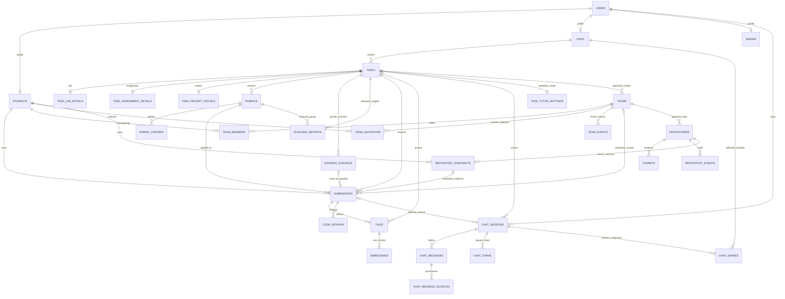

# UniAssist database design — implemented foundations and planned expansion

This reference describes the current schema and separates it from planned workflows.
For exact runtime contracts, read [FRONTEND_API_GUIDE.md](FRONTEND_API_GUIDE.md).
For scope, rollout and resumption, read [BACKEND_UI_INTEGRATION_PLAN.md](BACKEND_UI_INTEGRATION_PLAN.md).

## 1. Product and authority

UniAssist is a task-centered university workspace, not a full LMS. Work types are lab,
assignment and project; there are no course/enrollment/attendance entities.

Students submit individual attempts. TAs prepare tasks/rubrics and evaluate work; only professors
accept/reject rubrics and confirm final grades. Admin account management is implemented without academic content access.
Role checks are application-layer checks against the authenticated database identity; do not claim
that an ordinary foreign key alone enforces professor status.

## 2. Academic rules

- Tasks are visible to matching cohort and major; null target major means all majors in the cohort.
- Labs are visible immediately. scheduled_date is informational; due_date controls submission.
  The previous one-day visibility rule is superseded. Labs require a reference PDF and scheduled date;
  due_date must not precede scheduled_date.
- An accepted rubric is required to submit. It is not required to read a task or use tutoring.
- Assignments with allow_late=true may accept attempts after their deadline. All other submissions
  close at the deadline, and every type closes after a professor-confirmed grade for that student.
- There is no reopen/publish/draft task workflow in the current API.
- Each attempt permanently retains its rubric, text and linked artifact. Only the latest pending
  attempt may be evaluated. New versions/attempts never overwrite historical work.
- Approved rubric names/descriptions/points are student-visible before submission. Keep private
  answers out of these public fields. AI scores, feedback and findings remain hidden until confirmation.
- Individual projects work with require_team=false. Team-required projects require consented,
  staff-approved membership; submissions and grades remain individual.
- Tutoring is private and available whenever task access is allowed, including after deadlines/release.

## 3. Entity map

TASKS.reference_file_id designates the public reference file; it is no longer stored on
TASK_LAB_DETAILS. CHAT_TURNS references its user message and optional assistant message.
The diagram shows relationships, not proof that all entities have a public API.

## 4. Implemented tables and persistence

| Area | Tables and important fields |
| --- | --- |
| Identity | USERS identity/password hash/role; STUDENTS number/cohort/major/GitHub username; STAFF role/department; ADMINS permission level |
| Task | TASKS title/description/due/cohort/major/creator/reference_file_id; typed detail tables |
| Lab | TASK_LAB_DETAILS scheduled_date; reference points from parent TASKS |
| Assignment | TASK_ASSIGNMENT_DETAILS allowed_file_types JSON and allow_late |
| Project | TASK_PROJECT_DETAILS default_repo_provider and require_team |
| Rubric | RUBRICS task/version/source/status/reviewer/timestamps; RUBRIC_CRITERIA name/description/max_points/sort_order |
| Attempts | SUBMISSIONS task/student/optional team/rubric/attempt_number/is_latest/status, submission_text, grading and release audit |
| Persisted evaluation | SUBMISSIONS total_possible_grade, criterion_evaluations JSON, ai_warnings JSON, nullable is_mock; CODE_REVIEWS evidence |
| Files | FILES owner/task/submission/purpose/type/private path/original_filename/uploaded_at |
| Reference text | EMBEDDINGS file/task/chunk index/text/vector placeholder/model_version |
| Chat | CHAT_SESSIONS owner/task/optional submission/title/language/request_id/context_snapshot/timestamps |
| History | CHAT_MESSAGES session/sender/content/timestamp; CHAT_MESSAGE_SOURCES optional embedding/finding links |
| Tutor turns | CHAT_TURNS session/request_id/message IDs/status/attempt_count/generation/lease_until/error/mock/context metadata |
| Consent | CHAT_SHARES session/recipient/request ID/cutoff turn/frozen snapshot/creation/revocation timestamps |
| Lab guidance | TASK_TUTOR_SETTINGS task/mode/updated_by/updated_at; absent row means experiment |
| Private marking | GRADING_GUIDANCE task/version/content/request ID/author/time; SUBMISSIONS.grading_guidance_id records the version used |
| Teaching reports | TEACHING_REPORTS task/rubric/version/language/request ID/author/time, input fingerprint/snapshot, result/mock/safe metadata |

Older lost submission text remains empty, and unknown original filenames/mock provenance remain null.
Downloads use a safe filename fallback; do not manufacture historical values.

EMBEDDINGS currently contains text chunks with placeholder vector IDs and model version
none:text-chunk-only. There is no functioning external vector database or semantic retrieval.
Reference context selects only the file designated by TASKS.reference_file_id, never student uploads.

Professor task deletion cascades through related academic records. Physical upload bytes remain on
disk until an explicit retention/cleanup policy is implemented; removed records cannot be downloaded.

## 5. Tutoring transactions

- Session request IDs are unique per user (nullable for legacy rows); turn request IDs are unique per session.
- A turn persists a user message before provider execution. It can be pending, completed or failed.
- A short per-user PostgreSQL advisory transaction lock serializes deduplication, rate checks and
  reservation. No database transaction is held throughout the provider call.
- One nonexpired pending turn per conversation. A generation token fences late responses.
- Completed duplicate requests replay the existing result. Failed requests require explicit retry.
- Pending leases expire after provider timeout plus grace; interrupted turns become retryable.
- GET presents expiration without writing; a retry reserves a new generation. This guarantees one
  visible completed reply per turn, not exactly-once billing at the external provider.
- Context uses public task/reference/approved rubric and optional owned submission text; feedback
  enters only after release. No private model answers or implicit artifact ingestion.
- Provider context uses completed bounded history, not failed prompts or client-supplied roles.
- Existing legacy user/assistant messages have a paginated owner-only read path and enter bounded
  history. System messages are excluded; old provenance remains unknown. Shares include new completed
  turns only, never unpaired legacy history.
- Shares persist immutable preview-validated snapshots to one staff recipient. Revoke timestamps block
  further recipient reads without changing original messages. Unique session/request ID deduplicates writes.
- Turn context_info stores actual public materials used, not invented citations/relevance scores.
  ai_metadata stores sanitized provider/model/version/latency information; no opaque provider diagnostics.

## 6. Teams and planned workflows

TEAMS/TEAM_MEMBERS now have main APIs/UI. Migration f6a20260918 adds TEAM_INVITATIONS,
TEAM_EVENTS, approval snapshots and SUBMISSIONS.team_snapshot:

- Student invitations accepted by every member, then staff approval of complete roster.
- At most one active team per student/task; roster changes invalidate approval and lock after first submission.
- Grades remain individual, one student-owned submission at a time; team is context, not grading authority.
- TEAMS stores creator/create-request UUID, status, version, approved_roster JSON and locked_at.
- TEAM_MEMBERS retains inactive memberships, task_id and nullable accepted_at; a partial unique
  index on (task_id, student_id) WHERE active enforces one active membership per task.
- TEAM_INVITATIONS preserves pending/accepted/declined/cancelled records and response times;
  a partial unique index prevents duplicate pending team/student invitations.
- TEAM_EVENTS stores actor, request UUID/hash, action, version, timestamp and immutable roster JSON.
  (actor_id, request_id) is unique. Submission snapshots copy the exact approved roster.
- Actor-then-task advisory locks serialize roster mutations; submissions take the same task lock
  before the existing student/task attempt lock. Version checks prevent approval of stale rosters.
- Task deletion cascades through team records. Otherwise history is preserved; archiving releases
  memberships without deleting events. No team relationship grants access to individual work.
- Legacy rows use status=legacy with unknown creator/consent/approval; old snapshots remain null.
  locked_at is backfilled only from actual historical submission timestamps. Membership slots remain
  reserved, and legacy records are read-only/review-blocked pending a separate remediation process.
- Duplicate historical task/student memberships abort migration before changes; never discard them.

REPOSITORIES/COMMITS now have public-GitHub APIs/UI (f7a20260919):

- Repository links store canonical public identity (full_name plus numeric github_id), proposer/request
  UUID, status/version, approved_team_version, last successful sync/error, partial-history and fixture flags.
- Partial unique (team_id) WHERE status='approved' permits only one active repository. Replacements
  supersede old links, preserving records and evidence. A changed approved roster requires reapproval.
- Unique (repository_id,commit_hash) makes imports idempotent. GitHub username metadata is not a
  verified student association. attributed_by/attributed_at record reviewed assignments or clearing.
- REPOSITORY_EVENTS is immutable actor/request-deduplicated proposal/approval/sync/correction audit.
  Attribution corrections preserve old/new student IDs. Counts never grade contribution or effort.
- REPOSITORY_SNAPSHOTS holds owner, request UUID, SHA, original compressed archive BYTEA and JSON
  provenance (digest, manifest, source ID, approval versions, selected-commit attribution and fixture
  flag). Archive data is deferred in ORM reads; downloads/assessment load it only after authorization.
- SUBMISSIONS.repository_snapshot_id is nullable; upload and repository evidence are mutually exclusive,
  with optional explanation text. A snapshot is student-owned, not a team-shared artifact. Historical
  attempts stay null. Resubmissions may reuse immutable evidence after current eligibility checks.
- Roster/task locks serialize repository approval/replacement, captures and submissions. Capture is
  staged and does not lock membership; successful attempt creation locks the roster as before. Failed
  sync retains prior data and persists only a sanitized error; no successful event is fabricated.
- Grading verifies the archive digest and reads stored bounded contents, not live GitHub. Branch changes,
  unavailable sources, link replacements and later attribution corrections do not rewrite submitted data.
- Archives remain in PostgreSQL across restart. Backups/capacity/retention must account for staged and
  submitted archives. There is no snapshot deletion API or automatic cleanup. Task deletion cascades
  through repository, snapshot and submission records consistently.
- Legacy links remain status=legacy without invented identity/approval. Existing commits/student IDs
  remain stored but are not represented as reviewed attribution. Duplicate repository/SHA rows abort
  migration before changes for manual review; no legacy records are silently discarded.

Administrative status/audit and durable operations use f8a20260919:

- USERS.is_active defaults true for preserved and new accounts; profile_version starts at 1.
  Login and authenticated requests consult current status/role. Account corrections increment the
  version; TA/professor transitions also update STAFF.staff_role. No role-class conversion/deletion.
- AUDIT_EVENTS holds actor ID (nullable operator), action, target type/ID, changed field names and time.
  Application writes are append-only, transactional with changes, and contain no values/private content.
  Target IDs intentionally are not cascading foreign keys: task deletion cannot erase the audit trail.
- AI_OPERATIONS holds operation, allowlisted provider, outcome=started|success|error, measured latency,
  nullable actual-mock/truncation flags and creation time (indexed). Independent transactions retain
  failures on academic rollback. Started rows may survive process interruption; unknown flags are not
  fabricated. No prompt/reply/key/transcript/identity or arbitrary provider metadata is persisted.
- Bootstrap and account changes share a PostgreSQL advisory lock; last-active-admin checks and
  expected_version protect concurrent edits/suspensions. Existing admins remain active for operator
  review, not automatically deleted. No audits/metrics are backfilled from historical private data.
- Academic corrections affect future access; historical approved rosters, submissions and attribution
  remain frozen. GitHub username changes do not establish commit identity. No automatic cleanup or
  retention job exists. Include operational tables in backups and choose retention separately.

Private grading guidance and teaching reports are implemented by f5a20260918. Both are immutable,
task-scoped and deduplicated by task/request ID. Guidance versions are unique per task; an empty
latest version means no key content for subsequent grading. Historical evaluation pointers stay null.
Reports store staff-visible aggregate snapshots, not identities or student work. Latest confirmed
attempts per student are grouped by rubric; group/criterion thresholds prevent undersized analysis.
Original criterion evidence is never rewritten by professor overrides. A hash of released numeric
evidence detects stale reports; generation never changes grades. Advisory task locks prevent concurrent
duplicate generation; bounded synchronous provider failures roll back report writes. Foreign-key
cascades preserve professor task deletion, and report/guidance history otherwise remains intact.

## 7. Integrity and compatibility

Current database constraints include unique user email, student number, rubric task/version,
submission task/student/attempt number, team/member composite key, and chat request uniqueness.

Accepted-rubric transitions and latest-attempt creation use application transaction locks.
Do not describe these as partial unique database indexes unless migrations actually add them.
Professor confirmation and team eligibility also require application authorization checks.

Repository/commit uniqueness includes a legacy-data preflight; conflicts are reported rather than
resolved by deleting user records. Future constraints require the same treatment.
GitHub usernames are currently neither proof of identity nor a unique constraint.

Migration head: f8a20260919 (account status/version and content-free audit/AI operations after f7a20260919).
Test both fresh PostgreSQL and historical-schema upgrades. Preserve migration identities and never
recreate a user's database or delete volumes to make an upgrade succeed.

## 8. Deferred capabilities

Courses/sections/terms, communication monitoring, automated contribution scoring, practice generation,
email/push delivery, private repositories and additional task types remain deferred.
Cohort teaching insights are aggregate teaching aids, not individual surveillance or rankings.
